# Ejemplos y Ejercicios Liquibase

La presente documentación tiene como finalidad mostrar los comandos principales disponibles por Liquibase para la administración de los cambios en las bases de datos.

## Tabla de Contenido

* [Precondiciones](#precondiciones)
* [Configuración](#configuración)
* [Ejecución](#ejecución)
	* [Comandos de Seguimiento a Cambios](#comandos-de-seguimientos-de-cambios)
		* [Comando History](#command-history)
		* [Comando Status](#command-status)
	* [Comandos de Actualización de Base de Datos](#comandos-de-actualización-de-bases-de-datos)
		* [Comando Update-Sql](#command-update-sql)
		* [Comando Update](#command-update)
	* [Comandos de Inspección de Base de Datos](#comandos-de-inspección-de-bases-de-datos)
		* [Comando Diff](#command-diff)
		* [Comando Diff-Changelog](#command-diff-changelog)
      * [Comando Generate-Changelog](#command-generate-changelog)
	* [Comandos de Rollback de Base de Datos](#comandos-de-rollback-de-bases-de-datos)
		* [Comando Rollback-To-Date](#command-rollback-to-date)
        * [Comando Rollback-To-Count](#command-rollback-count)
        * [Comando Rollback-Tag](#command-rollback-tag)
* [Más información](#más-información)

## Precondiciones

* **Tener instalado Liquibase.**

Para comprobar la versión Liquibase instalada, se utiliza el siguiente comando:

```bash
liquibase --version
```
Se debe visualizar como se muestra a continuación:


Para el presente arquetipo, se utiliza la última versión de Liquibase disponible a partir de Noviembre 2023 - Versión 4.25.0.

Para obtener la última versión de Liquibase disponible, se puede descargar desde aquí: [Descargar Liquibase](https://www.liquibase.com/download).

* **Tener disponible un Servidor de Base de Datos**

Los ejercicios y prácticas que se ejecutarán requieren de un servidor de Base de Datos para poder ejecutar los comandos Liquibase, en específico se realizará sobre una Base de Datos Postgres. En caso de no contar con una, a continuación, se especifican los pasos para poder levantar un servicio en Docker.

* Ejecutar el siguiente comando para crear el servidor Postgres en Docker


```bash
docker run --name postgres -d -p 5432:5432 -e POSTGRES_PASSWORD=password postgres:alpine
```

En Docker, se visualizará el contenedor de la siguiente manera:

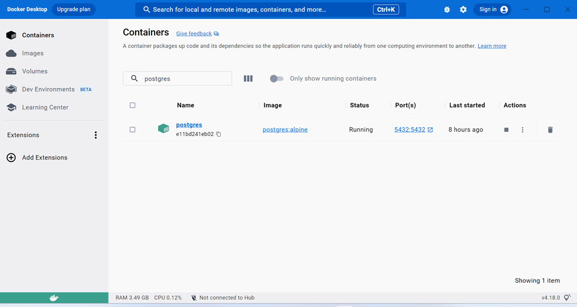

Con este comando se expone un servidor de base de datos con las siguientes credenciales:

* Ip: localhost / 127.0.0.1
* Puerto: 5432
* Usuario: postgres
* Password: password

>

* **Tener disponible una Herramienta Gestora de Base de Datos**

Se recomienda contar con una herramienta de gestión de base de datos Postgres para visualizar los registros generados a partir de la ejecución de los changelogs y verificar que los cambios se hayan aplicado correctamente.

A continuación, se colocan los enlaces de descarga de algunas herramientas que nos permitirán realizar los ejercicios.

* [DBeaver](https://dbeaver.io/download/).
* [PgAdmin 4](https://www.pgadmin.org/download/).

## Configuración
El siguiente paso es crear la Base de Datos que nos permitirá aplicar los cambios establecidos en los changelogs.

Para lo cual, se requiere se ejecuten los siguientes pasos:

* **Crear la conexión con el Servidor**. Con la herramienta de administración de Base de datos seleccionada, establecer una conexión hacia el Servidor. Para lo cual se utilizarán las credenciales disponibles para el servidor o utilizar las ingresadas al crear el contenedor.

Para la herramienta DBeaver, se visualiza de la siguiente manera:

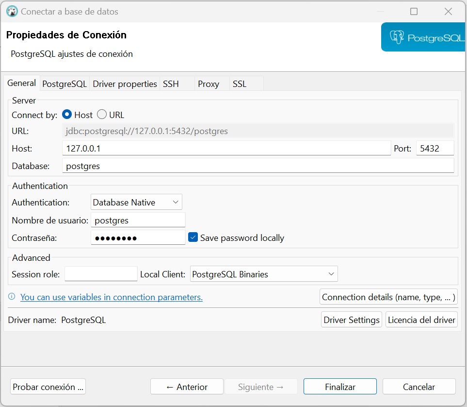

Para la herramienta PgAdmin, se visualiza así:

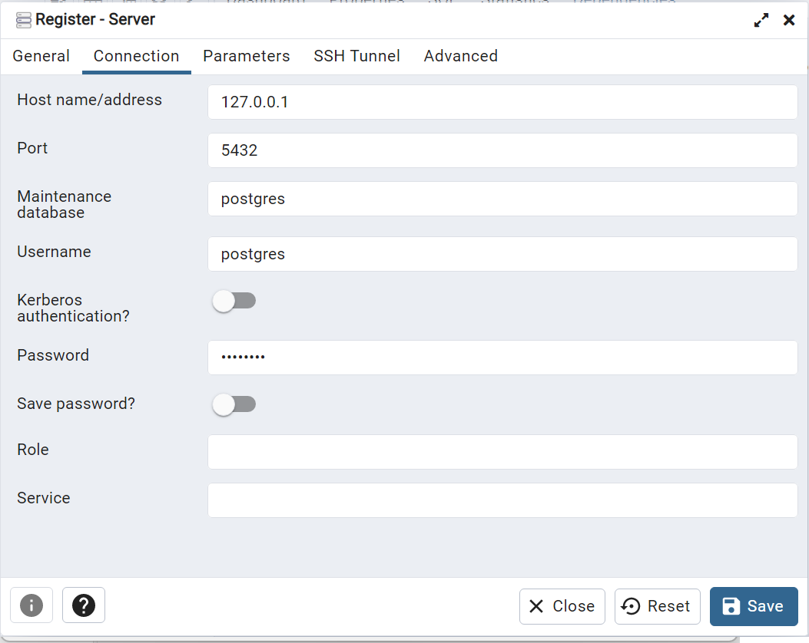

* **Ejecución de Script**. Ejecutar el siguiente script que permitirá crear la Base de Datos con el Nombre de Formularios:

[create database](../scripts/create_database.sql).

Al finalizar la ejecución del Script, se creará la base de datos, la salida se visualiza de la siguiente manera:

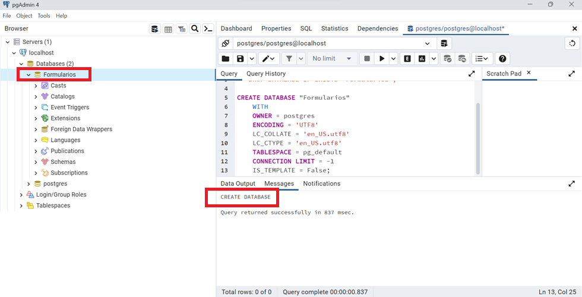

* **Configuración del archivo liquibase.properties**. El archivo liquibase.properties disponible en el arquetipo, contiene la configuración establecida para para los ejercicios que se ejecutaran, en caso de generar una nueva configuración, se detalla la siguiente información:

La url del comando de liquibase, contiene la siguiente sintaxis:

```bash
jdbc:<database>://<host>:<port>/<database_name>;<URL_attributes>
```
Por lo que, la url del archivo de liquibase, se visualiza de la siguiente manera:

```bash
liquibase.command.url=jdbc:postgresql://localhost:5432/Formularios
```
Adicional, se muestran los otros parámetros más importantes disponibles en el archivo:

**Ruta del archivo changelog**

```bash
changeLogFile=./changelog/db-changelog-root.yaml
```

**Url de la Base de Datos destino**
```bash
liquibase.command.url=jdbc:postgresql://localhost:5432/Formularios
```

**Usuario de la Base de Datos destino**
```bash
liquibase.command.username: postgres
```

**Password de la Base de Datos destino**
```bash
liquibase.command.password: password
```

**Existen otros parámetros que se pueden configurar, sin embargo, se explicará más a detalle cuando se analicen los comandos diff y diff-changelog.**


## Ejecución

Liquibase dispone de varios comandos que pueden ayudar a migrar y realizar cambios en las bases de datos. A continuación, se detalla la clasificación y los comandos que se utilizarán durante los ejercicios.

```xml
Comandos de actualización de Bases de Datos
	update
	update-sql

Comandos de rollback de Bases de Datos
	rollback-to-date
	rollback-count
  rollback-tag

Comandos de inspección de Bases de Datos
	diff
	diff-changelog
	generate-changelog

Comandos de seguimiento de cambios
	history
	status
```


La ejecución de algunos comandos será en cierto orden para visualizar los resultados.

Para ejecutar los comandos, debemos ubicarnos en la ruta donde hemos clonado el repositorio, donde se encuentre ubicado el archivo liquibase.properties:

Ejemplo: "C:\Repositorios\proyecto\bd\liquibase\"

Abrir una terminal y ejecutar los comandos con el siguiente formato:

```bash
liquibase <command> <arguments>
```

**Para la mayoría de los comandos, los parámetros de conexión, usuario y password se encuentra dentro del archivo liquibase.properties, sin embargo, el paso de parámetros se puede hacer directamente sobre la consola, *el uso de la CLI para ingresar argumentos de la línea de comandos siempre anulará las propiedades almacenadas en el archivo de propiedades de Liquibase.***

##### Comandos de Seguimientos de Cambios

Hay dos comandos de Liquibase que proporcionan el estado de la base de datos:

* **History**.
* **Status**.

###### Command History

El comando *History* enumerará los changesets implementados. Este comando es útil para inspeccionar un grupo de cambios y asegurarse de que se hayan aplicado a la base de datos.

Nos muestra una lista donde se puede visualizar la historia de los changesets aplicados a la Base de Datos.

Ejecutamos el siguiente comando en la terminal

```bash
liquibase history
```

Hasta este punto, no hemos aplicado ningún cambio a la Base de Datos, por lo que el comando nos muestra la siguiente salida:

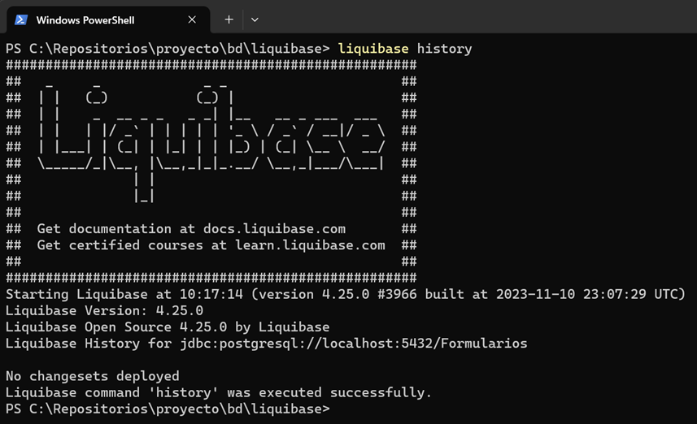

Puntos a resaltar:

* Nos muestra que no se han aplicado cambios a la Base de Datos y la URL de conexión: 

*Liquibase History for jdbc:postgresql://localhost:5432/Formularios*
*No changesets deployed*

* Muestra el estado de ejecución del comando

```XML
Liquibase command 'history' was executed successfully.
```


###### Command Status

El comando *status* indica el número de changesets no implementados. El estado de ejecución enumera todos los changesets no implementados. También enumera el identificador, el autor y el nombre de la ruta del archivo para cada changesets no implementado. **El comando de status no modifica la base de datos**.

Abrir una terminal y ejecutar el comando:

```bash
liquibase status
```

Hasta este punto, este comando nos muestra una lista de los changesets que aún no hemos aplicado, por lo que la salida se visualizará de la siguiente manera:


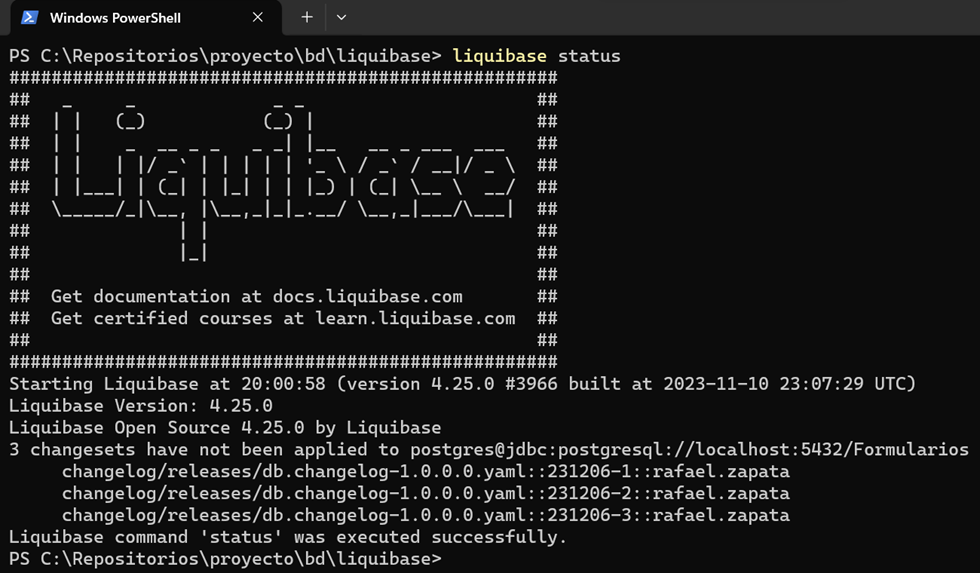

Puntos a resaltar:

* Números de changesets no aplicados a la Base de Datos y la URL de conexión: 

*3 changesets have not been applied to postgres@jdbc:postgresql://localhost:5432/Formularios.*

* Muestra la lista de los changesets pendientes, ruta del archivo changelogs, identificador y autor.

```XML
changelog/releases/db.changelog-1.0.0.0.yaml::231206-1::username.lastname
changelog/releases/db.changelog-1.0.0.0.yaml::231206-2::username.lastname
changelog/releases/db.changelog-1.0.0.0.yaml::231206-3::username.lastname
```

* Muestra el estado de ejecución del comando

```XML
Liquibase command 'status' was executed successfully.
```

##### Comandos de Actualización de Bases de Datos

El comando de actualización de Liquibase ejecuta cambios no implementados en una Base de Datos de destino específica. Cuando los cambios en la base de datos se implementan por primera vez en un nuevo proyecto de Liquibase, las dos tablas de seguimiento de Liquibase se crean en la base de datos:

* Tabla DATABASECHANGELOG.
* Tabla DATABASECHANGELOGLOCK.

Básicamente, con éstas tablas Liquibase puede obtener información de cuáles cambios se han ejecutado, cuáles se encuentran pendientes, cuándo se puede ejecutar una actualización, etc. Aquí un poco más de detalle del propósito de cada tabla:

* Tabla DATABASECHANGELOG: Rastrea cada conjunto de cambios implementado correctamente como una sola fila identificada por una combinación de ID del conjunto de cambios, autor y nombre de archivo especificado en el registro de cambios.
Liquibase compara el registro de cambios con la tabla de seguimiento para determinar qué conjuntos de cambios deben ejecutarse.

* Tabla DATABASECHANGELOGLOCK: Evita conflictos entre actualizaciones simultáneas. Esto puede suceder si varios desarrolladores usan la misma instancia de base de datos o si varios servidores en un clúster ejecutan automáticamente Liquibase al inicio.
La tabla establece la columna LOCKED en 1 cuando se está ejecutando una actualización.

**Liquibase espera hasta que se libere el bloqueo antes de ejecutar otra actualización.**

Dentro de los comandos de actualización de Bases de Datos, Liquibase, proporciona los siguiente:
* **Update-sql**
* **Update**

###### Command Update-Sql

El comando *Update-Sql* es un comando auxiliar que le permite inspeccionar las sentencias SQL que Liquibase ejecutará mientras usa el comando *Update*.

Este comando permite visualizar los create table, insert, alter table, etc, en formato SQL contenidos en los changesets que se ejecutarán con el comando *Update*.

Para ejecutar este comando, abrir una terminal y colocar:

```bash
liquibase update-sql
```

La salida del comando se visualiza de esta manera:

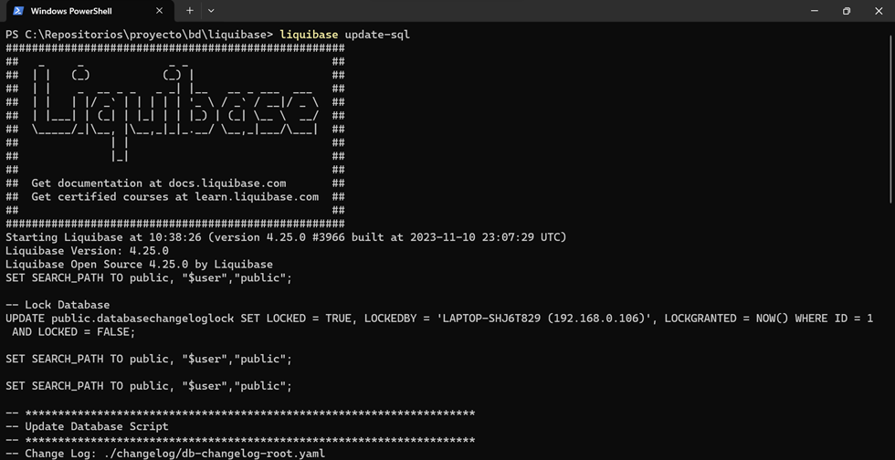

Puntos a resaltar:

* Ruta del Changelogs:

```XML
 Change Log: ./changelog/db-changelog-root.yaml
```

* Conexión hacia la Base de Datos:

```XML
Against: postgres@jdbc:postgresql://localhost:5432/Formularios
```

* Salidas de Sentencias Sql:

```XML
SET SEARCH_PATH TO public, "$user","public";

-- Changeset changelog/releases/db.changelog-1.0.0.0.yaml::231206-1::username.lastname
SET SEARCH_PATH TO public, "$user","public";

CREATE TABLE public.k_form (id INTEGER GENERATED BY DEFAULT AS IDENTITY NOT NULL, st_name TEXT NOT NULL, st_description TEXT NOT NULL, fg_active BOOLEAN NOT NULL, str_js_ui_schema TEXT, str_js_schema TEXT, CONSTRAINT "PK_c_form" PRIMARY KEY (id));

INSERT INTO public.databasechangelog (ID, AUTHOR, FILENAME, DATEEXECUTED, ORDEREXECUTED, MD5SUM, DESCRIPTION, COMMENTS, EXECTYPE, CONTEXTS, LABELS, LIQUIBASE, DEPLOYMENT_ID) VALUES ('231206-1', 'username.lastname', 'changelog/releases/db.changelog-1.0.0.0.yaml', NOW(), 1, '9:be37f9d38e272a101d9588ddfa151280', 'createTable tableName=k_form', '', 'EXECUTED', NULL, NULL, '4.25.0', '1967107053');
```

* Muestra el estado de ejecución del comando

```XML
Liquibase command 'update-sql' was executed successfully.
```

###### Command Update

El comando de *Update* implementa cualquier cambio que esté en el archivo changelogs y que aún no se haya implementado en la Base de Datos.

Cuando se ejecuta este comando, Liquibase lee secuencialmente los changesets en el archivo changelogs, luego compara los identificadores únicos, autor y ruta del nombre de archivo con los valores almacenados en la tabla DATABASECHANGELOG. Si los identificadores únicos no existen, Liquibase aplicará el conjunto de cambios a la Base de Datos.

Para ejecutar este comando, abrimos una consola y colocamos:

```bash
liquibase update
```

La salida de este comando, se visualiza de la siguiente manera:


Puntos a resaltar:

* Nos muestra una lista de todos los changesets ejecutados, con la información de ruta, identificador y author:

```XML
Running Changeset: changelog/releases/db.changelog-1.0.0.0.yaml::231206-1::username.lastname
Running Changeset: changelog/releases/db.changelog-1.0.0.0.yaml::231206-2::username.lastname
Running Changeset: changelog/releases/db.changelog-1.0.0.0.yaml::231206-3::username.lastname
```

* Información general de los changesets ejecutados y del estado del comando:

```XML
Liquibase: Update has been successful. Rows affected: 3
Liquibase command 'update' was executed successfully.
```

###### Verificar los Resultados de Actualización

La verificación de la actualización de la Base de Datos se puede lograr utilizando varios métodos diferentes, incluido el uso de comandos específicos de Liquibase y/o la inspección directa de la Base de Datos.

**Ejecución de Comandos Liquibase**

Una forma de saber si los changesets fueron aplicados, es ejecutando el comando *History*:

```bash
liquibase history
```

La salida que nos presenta es la siguiente:


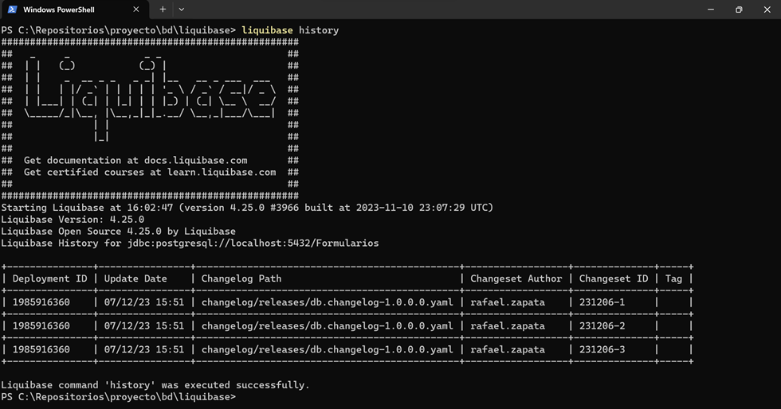

Nos muestra una lista detallada de los changesets aplicados sobre la Base de Datos, tal como se visualizan:

```XML

+---------------+----------------+----------------------------------------------+------------------+--------------+-----+
| Deployment ID | Update Date    | Changelog Path                               | Changeset Author | Changeset ID | Tag |
+---------------+----------------+----------------------------------------------+------------------+--------------+-----+
| 1985916360    | 07/12/23 15:51 | changelog/releases/db.changelog-1.0.0.0.yaml | username.lastname| 231206-1     |     |
+---------------+----------------+----------------------------------------------+------------------+--------------+-----+
| 1985916360    | 07/12/23 15:51 | changelog/releases/db.changelog-1.0.0.0.yaml | username.lastname| 231206-2     |     |
+---------------+----------------+----------------------------------------------+------------------+--------------+-----+
| 1985916360    | 07/12/23 15:51 | changelog/releases/db.changelog-1.0.0.0.yaml | username.lastname| 231206-3     |     |
+---------------+----------------+----------------------------------------------+------------------+--------------+-----+
```

Otra forma de comprobar la ejecución de los changesets, es utilizando el comando *Status*

```bash
liquibase status
```


El comando *Status* como ya se indicó, nos muestra una lista de los changesets que aún no se han aplicado a la Base de Datos, en este punto, el comando no nos muestra ningún cambio pendiente, ya que los cambios se aplicaron correctamente y que se encuentra actualizado, tal como se visualiza:

```XML
postgres@jdbc:postgresql://localhost:5432/Formularios is up to date
Liquibase command 'status' was executed successfully.
```

**Inspección directa en la Base de Datos**

Otro método para verificar que los cambios se aplicaron correctamente, es verificar los objetos en la base de datos, tablas, columnas, etc. Para lo cuál para los changesets que se ejecutaron podemos revisar lo siguiente:

* Creación de las Tablas

Podemos inspeccionar los objetos creados en la Base de Datos, debería visualizar 4 tablas:

* Tabla Databasechangelog: Tabla de control de Liquibase
* Tabla Databasechangeloglock: Tabla de control de Liquibase
* Tabla K_Form
* Tabla K_Form_Data

Tal como se visualizan:

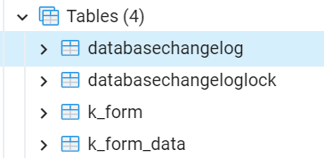

Adicional, podemos realizar un *Select* a la tabla Databasechangelog, y podemos ver el registro de los changesets ejecutados:


##### Comandos de Inspección de Bases de Datos

Liquibase proporciona dos comandos de diferenciación para que los usuarios puedan comparar fácilmente Bases de Datos para encontrar objetos faltantes, ver si se realizaron cambios específicos en la base de datos e identificar cualquier elemento inesperado en la Base de Datos.

###### Command Diff

El comando *Diff* en Liquibase le permite comparar dos bases de datos del mismo tipo o de diferentes tipos entre sí.

Este comando se puede utilizar para varias tareas diferentes:

* Para encontrar objetos faltantes o inesperados en una base de datos.
* Comparar dos bases de datos.
* Verificar que todos los cambios esperados estén en el changelogs.
* Detectar desviaciones en la base de datos.

El comando *Diff* produce una lista de categorías y una de tres descripciones:

* Faltantes: Objetos en la base de datos de origen que no están en la base de datos de destino.
* Inesperados: Objetos en la base de datos de destino que no están en la base de datos de origen.
* Modificados: El objeto tal como existe en la base de datos de origen es diferente al que existe en la base de datos de destino.

Para realizar pruebas con el comando **Diff*, se requiere realizar unos pasos adicionales, se enlista a continuación:

* **Crear Base de Datos Destino**: Se requiere una Base de Datos adicional, para tener disponible la Base de Datos origen y la destino.

Por lo que, al momento de realizar la instalación del Servidor Docker, para levantar el Servidor de Base de Datos Postgres, se crea por default la Base de Datos Postgres, en caso de no tenerla disponible, se adjunta el script para crear dicha Base de Datos. [Crear Base de Datos Postgres](../scripts/create_database_postgres.sql).

* **Configurar el archivo liquibase.properties**: En un apartado anterior, se mencionó que el archivo liquibase.properties contenía parámetros adicionales, se utilizan para configurar la información de URL, Usuario y Password de la Base de Datos Origen y Destino. El contenido de este archivo, se visualiza de la siguiente manera:

**Ruta del archivo Changelog**
```XML
changeLogFile=./changelog/db-changelog-root.yaml
```

**URL de la Base de Datos Destino**

```XML
liquibase.command.url=jdbc:postgresql://localhost:5432/postgres
```

*Nota: Se realizó el cambio del nombre de la Base de Datos, ya que lo que se requiere es comparar la Base de Datos donde se encuentran aplicados los cambios (Base de Datos Formularios) con la Base de Datos donde requieren aplicar los cambios (Base de Datos Posgres).*

**Usuario de la Base de Datos Destino**

```XML
liquibase.command.username: postgres
```

**Password de la Base de Datos Destino**
```XML
liquibase.command.password: password
```

**URL de la Base de Datos Origen**
```XML
liquibase.command.referenceUrl: jdbc:postgresql://localhost:5432/Formularios
```
*Nota: En este parámetro colocamos la Base de Datos Formularios, ya que es la Base de Datos que contiene los cambios aplicados.*

**Usuario de la Base de Datos Origen**

```XML
liquibase.command.username: postgres
```

**Password de la Base de Datos Origen**
```XML
liquibase.command.password: password
```

La configuración de este archivo, se puede visualizar en el siguiente archivo:  [Archivo Liquibase Properties Source - Target ](../liquibase-source-target.properties).

Con las configuraciones realizadas, ya es posible ejecutar el comando **Diff**, por lo que se abre una terminal y se ejecuta el siguiente comando:

```bash
liquibase diff
```

La salida de este comando se visualiza a continuación:

```XML
Diff Results:
Reference Database: postgres @ jdbc:postgresql://localhost:5432/Formularios (Default Schema: public)
Comparison Database: postgres @ jdbc:postgresql://localhost:5432/postgres (Default Schema: public)
Compared Schemas: public
Product Name: EQUAL
Product Version: EQUAL
Missing Catalog(s): NONE
Unexpected Catalog(s): NONE
Changed Catalog(s):
     Formularios
          name changed from 'Formularios' to 'postgres'
Missing Column(s):
     public.databasechangelog.author
     public.databasechangelog.comments
     public.databasechangelog.contexts
     public.databasechangelog.dateexecuted
     public.databasechangelog.deployment_id
     public.databasechangelog.description
     public.databasechangelog.exectype
     public.k_form.fg_active
     public.k_form_data.fg_active
     public.databasechangelog.filename
     public.databasechangelog.id
     public.databasechangeloglock.id
     public.k_form.id
     public.k_form_data.id
     public.k_form_data.id_form
     public.databasechangelog.labels
     public.databasechangelog.liquibase
     public.databasechangeloglock.locked
     public.databasechangeloglock.lockedby
     public.databasechangeloglock.lockgranted
     public.databasechangelog.md5sum
     public.databasechangelog.orderexecuted
     public.k_form.st_description
     public.k_form.st_name
     public.k_form_data.str_js_data
     public.k_form.str_js_schema
     public.k_form.str_js_ui_schema
     public.databasechangelog.tag
Unexpected Column(s): NONE
Changed Column(s): NONE
Missing Foreign Key(s):
     rl_form_data_x_c_form(k_form_data[id_form] -> k_form[id])
Unexpected Foreign Key(s): NONE
Changed Foreign Key(s): NONE
Missing Index(s):
     PK_c_form UNIQUE  ON public.k_form(id)
     PK_c_form_data UNIQUE  ON public.k_form_data(id)
     databasechangeloglock_pkey UNIQUE  ON public.databasechangeloglock(id)
Unexpected Index(s): NONE
Changed Index(s): NONE
Missing Primary Key(s):
     PK_c_form on public.k_form(id)
     PK_c_form_data on public.k_form_data(id)
     databasechangeloglock_pkey on public.databasechangeloglock(id)
Unexpected Primary Key(s): NONE
Changed Primary Key(s): NONE
Missing Schema(s): NONE
Unexpected Schema(s): NONE
Changed Schema(s): NONE
Missing Sequence(s): NONE
Unexpected Sequence(s): NONE
Changed Sequence(s): NONE
Missing Table(s):
     databasechangelog
     databasechangeloglock
     k_form
     k_form_data
Unexpected Table(s): NONE
Changed Table(s): NONE
Missing Unique Constraint(s): NONE
Unexpected Unique Constraint(s): NONE
Changed Unique Constraint(s): NONE
Missing View(s): NONE
Unexpected View(s): NONE
Changed View(s): NONE
Liquibase command 'diff' was executed successfully.
```

La salida del comando se muestra directamente sobre la terminal, este comando acepta como parámetro el argumento:  **--outputFile**, donde se puede especificar el nombre de un archivo, para que los resultados se muestren en el archivo, la forma de ejecutar el comando sería de la siguiente manera:

```bash
liquibase --outputFile=diff.txt diff
```

**Se creará un archivo con el nombre diff.txt en la ruta donde se encuentra el archivo liquibase.properties**

###### Command Diff-Changelog

El comando **Diff-Changelog* muestra las diferencias entre dos Bases de Datos que se están comparando. También genera un archivo changelogs que contiene conjuntos de cambios implementables para resolver la mayoría de estas diferencias.

Este comando acepta como parámetro el argumento: **--changelog-file** que permite especificar el nombre del archivo changelogs con el formato que se creará con los changesets que deben ejecutarse.

Los formatos en los cuales se puede generar el changelogs son:

* SQL
* XML
* YAML
* JSON

Los mismos parámetros de configuración del archivo liquibase.properties, servirá para ejecutar este comando, por lo que, abrir una terminal y ejecutar el siguiente comando:

```bash
liquibase  --changelog-file=changelogs.yaml diff-changelog
o
liquibase  --changelog-file=changelogs.sql diff-changelog
o
liquibase  --changelog-file=changelogs.xml diff-changelog
o
liquibase  --changelog-file=changelogs.json diff-changelog
```

En caso de seleccionar la extensión YAML, el comando generará un archivo con el nombre Changelogs.YAML donde se encuentra el archivo liquibase.properties con el siguiente contenido:

```XML
databaseChangeLog:
- changeSet:
    id: 1701994874155-1
    author: username.lastname (generated)
    changes:
    - createTable:
        columns:
        - column:
            autoIncrement: true
            constraints:
              nullable: false
              primaryKey: true
              primaryKeyName: PK_c_form
            name: id
            type: INTEGER
        - column:
            constraints:
              nullable: false
            name: st_name
            type: TEXT
        - column:
            constraints:
              nullable: false
            name: st_description
            type: TEXT
        - column:
            constraints:
              nullable: false
            name: fg_active
            type: BOOLEAN
        - column:
            name: str_js_ui_schema
            type: TEXT
        - column:
            name: str_js_schema
            type: TEXT
        tableName: k_form
- changeSet:
    id: 1701994874155-2
    author: username.lastname (generated)
    changes:
    - createTable:
        columns:
        - column:
            autoIncrement: true
            constraints:
              nullable: false
              primaryKey: true
              primaryKeyName: PK_c_form_data
            name: id
            type: INTEGER
        - column:
            constraints:
              nullable: false
            name: id_form
            type: INTEGER
        - column:
            constraints:
              nullable: false
            name: fg_active
            type: BOOLEAN
        - column:
            name: str_js_data
            type: TEXT
        tableName: k_form_data
- changeSet:
    id: 1701994874155-3
    author: username.lastname (generated)
    changes:
    - addForeignKeyConstraint:
        baseColumnNames: id_form
        baseTableName: k_form_data
        constraintName: rl_form_data_x_c_form
        deferrable: false
        initiallyDeferred: false
        onDelete: NO ACTION
        onUpdate: NO ACTION
        referencedColumnNames: id
        referencedTableName: k_form
        validate: true
```

###### Command Generate-Changelog

El comando *generate-changelog* crea un archivo de registro de cambios que tiene una secuencia de conjuntos de cambios que describen cómo recrear el estado actual de la base de datos.

Básicamente, este comando permite generar un archivo con el estado actual de base de datos como un respaldo y poder aplicarlo a otra Base de Datos para poder replicarlo.

Este comando acepta como argumento el parámetro: *--changelog-file* que es donde se puede especificar el nombre del archivo que se obtendrá como salida con todos los changesets actuales. 

Para realizar la ejecución del comando *generate-changelog*, se requiere modificar el archivo liquibase.properties, para comentar los parámetros de Base de Datos, Usuario y Password origen, ya que los comandos se ejecutarán sobre la Base de datos Formularios, que es donde se encuentran aplicados los cambios. Por lo que el contenido del archivo de configuración debería quedar de la siguiente manera:

```XML
changeLogFile=./changelog/db-changelog-root.yaml

liquibase.command.url=jdbc:postgresql://localhost:5432/Formularios

liquibase.command.username: postgres

liquibase.command.password: password
```
Abrir la consola y ejecutar el siguiente comando:

```bash
liquibase generate-changelog --changelog-file=bd-changelog.xml
```
Tal como se visualiza:


El comando generará el archivo *bd-changelog.xml* en la ruta donde se encuentra el archivo liquibase.properties y contendrá todos los changesets de los objetos actuales de la Base de Datos que permitirá realizar una recuperación de la misma.

##### Comandos de Rollback de Bases de Datos
Liquibase proporciona a los usuarios una forma de revertir los cambios de la base de datos mediante comandos de reversión. Los comandos de reversión deshacen secuencialmente los cambios que se han implementado en un punto específico, como una fecha, una cantidad de cambios o por nombre de etiqueta.

###### Command Rollback-To-Date

El comando *rollback-to-date* revierte la Base de Datos al estado en el que se encontraba en la fecha y hora que especifique.

**Es importante mencionar que el comando rollback-to-date se utiliza para revertir todos los cambios realizados en la base de datos desde la *fecha actual* a una fecha específica.**

En la tabla *Databasechangelog* en la columna *Dateexecuted* se puede observar la fecha en la que se ejecutó el cambio, tal como se muestra a continuación:


Si se observa la columna, los cambios se ejecutaron con Fecha: 2023-12-07, por lo que, para revertir los cambios, debemos ejecutar el comando rollback con fecha/hora anterior a la que se muestra.

Este comando acepta como argumento el parámetro: *--date* que es donde se puede especificar la fecha/hora a la que se requiere revertir los cambios. Los formatos para este argumento son:

```XML
YYYY-MM-DD HH:MM:SS
o
YYYY-MM-DD'T'HH:MM:SS
```
Adicional, sólo se puede especificar la hora.

Para revertir los cambios aplicados con el archivo changelogs. Abrir una consola y ejecutar el siguiente comando:

```bash
liquibase rollback-to-date --date=2023-12-06
```

**En el parámetro --date se especifica la fecha 2023-12-06, un día anterior a la aplicación de los cambios**.

La salida de este comando se muestra a continuación:

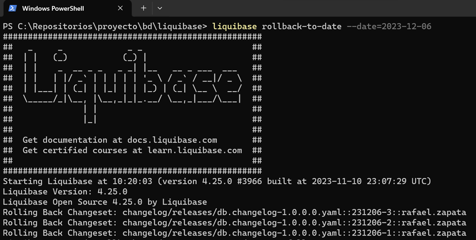

Puntos a resaltar:

* Se muestran los changesets que fueron revertidos:


```XML
Rolling Back Changeset: changelog/releases/db.changelog-1.0.0.0.yaml::231206-3::username.lastname
Rolling Back Changeset: changelog/releases/db.changelog-1.0.0.0.yaml::231206-2::username.lastname
Rolling Back Changeset: changelog/releases/db.changelog-1.0.0.0.yaml::231206-1::username.lastname
```

Para comprobar la ejecución del comando, se puede:

* Realizar un *Select* a la tabla *Databasechangelog* e inspeccionar los objetos de Base de Datos que se habían creado, tal como se muestra:


Se muestra que la tabla *Databasechangelog* se encuentra vacía, y las tablas: K_FORM y K_FORM_DATA ya no existen.

* Se puede ejecutar el comando *liquibase history*, el cual, muestra la siguiente salida:

```XML
No changesets deployed
Liquibase command 'history' was executed successfully.
```

Ya que se revirtieron los cambios y no existen cambios aplicados.

* Se puede ejecutar el comando *liquibase status*, el cual, muestra la siguiente salida:

```XML
3 changesets have not been applied to postgres@jdbc:postgresql://localhost:5432/Formularios
     changelog/releases/db.changelog-1.0.0.0.yaml::231206-1::rafael.zapata
     changelog/releases/db.changelog-1.0.0.0.yaml::231206-2::rafael.zapata
     changelog/releases/db.changelog-1.0.0.0.yaml::231206-3::rafael.zapata
Liquibase command 'status' was executed successfully.
```

Indicando que existen 3 cambios pendientes por aplicar.


###### Command Rollback-Count

El comando *rollback-count* se utiliza para revertir los cambios secuencialmente comenzando con el más reciente y avanzando hacia atrás.

En este punto, no existen cambios aplicados sobre la Base de Datos Formularios, para visualizar la funcionalidad de este comando, debemos aplicar cambios a la Base. Por lo que, abrir una terminal y ejecutar el siguiente comando:

```bash
liquibase update
```

Muestra la siguiente salida:

```XML
Running Changeset: changelog/releases/db.changelog-1.0.0.0.yaml::231206-1::username.lastname
Running Changeset: changelog/releases/db.changelog-1.0.0.0.yaml::231206-2::username.lastname
Running Changeset: changelog/releases/db.changelog-1.0.0.0.yaml::231206-3::username.lastname

UPDATE SUMMARY
Run:                          3
Previously run:               0
Filtered out:                 0
-------------------------------
Total change sets:            3

Liquibase: Update has been successful. Rows affected: 3
Liquibase command 'update' was executed successfully.
```

* Se Realizar un *Select* a la tabla *Databasechangelog* e inspeccionar los objetos de Base de Datos que se habían creado, tal como se muestra:


Se observan los changesets aplicados y las tablas creadas nuevamente.

En la tabla *Databasechangelog* se puede observar la descripción de los cambios aplicados, tal como se visualiza:


Se observa que:
* El changeset 1 corresponde a: *createTable tableName=k_form*
* El changeset 2 corresponde a: *createTable tableName=k_form_data*
* El changeset 3 corresponde a: *addForeignKeyConstraint baseTableName=k_form_data, constraintName=rl_form_data_x_c_form, referencedTableName=k_form*

El último changeset aplicado es el changeset 3, que corresponde al *ForeignKey*. Para revertir el cambio de este changeset, abrir una terminal y ejecutar el siguiente comando:

```bash
liquibase rollback-count 1
```
La salida se muestra a continuación:


Puntos a resaltar:

* Muestra la información del changesets que se revirtió:

```XML
Rolling Back Changeset: changelog/releases/db.changelog-1.0.0.0.yaml::231206-3::rafael.zapata
Liquibase command 'rollback-count' was executed successfully.
```

Para inspeccionar el resultado:

* Realizar un *Select* a la tabla *Databasechangelog*, tal como se muestra a continuación:


Se observa que el changeset 3 ya no existe.

* Ejecutar el comando *liquibase history*, mostrando la siguiente salida:

```XML
+---------------+----------------+----------------------------------------------+------------------+--------------+-----+
| Deployment ID | Update Date    | Changelog Path                               | Changeset Author | Changeset ID | Tag |
+---------------+----------------+----------------------------------------------+------------------+--------------+-----+
| 2054970697    | 08/12/23 11:02 | changelog/releases/db.changelog-1.0.0.0.yaml | user.lastname    | 231206-1     |     |
+---------------+----------------+----------------------------------------------+------------------+--------------+-----+
| 2054970697    | 08/12/23 11:02 | changelog/releases/db.changelog-1.0.0.0.yaml | user.lastname    | 231206-2     |     |
+---------------+----------------+----------------------------------------------+------------------+--------------+-----+

Liquibase command 'history' was executed successfully.
```

Sólo se observan 2 changesets aplicados

* Ejecutar el comando *Liquibase Status*, mostrando la siguiente salida:

```XML
1 changesets have not been applied to postgres@jdbc:postgresql://localhost:5432/Formularios
     changelog/releases/db.changelog-1.0.0.0.yaml::231206-3::rafael.zapata
Liquibase command 'status' was executed successfully.
```

Nos indica que existe un changeset por aplicar.

###### Command Rollback-Tag

El comando de *rollback-tag* deshace los cambios realizados en la base de datos según la etiqueta especificada.

Cuando se ejecuta este comando, Liquibase revertirá secuencialmente todos los cambios implementados hasta llegar a la fila de etiquetas en la tabla DATABASECHANGELOG. Por ejemplo, puede utilizar el comando *rollback* cuando desee deshacer una serie de cambios realizados en su base de datos relacionados con una etiqueta específica, como una versión numerada. Si tiene etiquetas para la versión 1, la versión 2 y la versión 3, y necesita hacer una corrección en la versión 2, el comando de reversión revertirá la versión 3 primero.

Para ejemplificar este comando, se requiere primero ejecutar el siguiente comando:

```bash
liquibase update
```

Esto permitirá tener la Base de Datos actualizada con los changesets (Se vuelve a aplicar el cambio que se había quitado con el comando Rollback)

Suponiendo que todos los cambios que se encuentran actualmente aplicados a la Base de Datos corresponden a una versión estable y que es la versión "v1", se puede aplicar una etiqueta para indicar que los conjuntos de cambios pertenecen a ésta versión y que los cambios siguientes, pueden quedar descartados. Para lo cual, abrir una terminal y ejecutar el siguiente comando:

```bash
liquibase tag --tag=v1
```

La salida se visualiza de la siguiente manera:

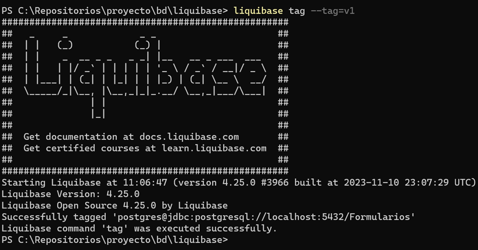

La ejecución del comando es que actualiza el último changesets de la tabla *Databasechangelog* y en la columna *Tag* le coloca el valor "v1", como se muestra:


Lo que indica que todos los cambios aplicados desde ese changesets hacia atrás, corresponden a la versión 1.

Para efectos de prueba, se requiere agregar un cambio posterior al changelogs, por lo que, se deben ejecutar los siguientes pasos:

* Modificar el archivo changelogs: Abrir el archivo \changelog\releases\db.changelog-1.0.0.0.yaml para agregar un cambio adicional, se anexa un ejemplo del cambio que se puede realizar:


```XML
- changeSet:
    id: 231206-4
    author: username.lastname
    changes:
    - createTable:
        columns:
        - column:
            autoIncrement: true
            constraints:
              nullable: false
              primaryKey: true
              primaryKeyName: PK_c_form_1
            name: id
            type: INTEGER
        - column:
            constraints:
              nullable: false
            name: st_name
            type: TEXT
        - column:
            constraints:
              nullable: false
            name: st_description
            type: TEXT
        - column:
            constraints:
              nullable: false
            name: fg_active
            type: BOOLEAN
        - column:
            name: str_js_ui_schema
            type: TEXT
        - column:
            name: str_js_schema
            type: TEXT
        tableName: k_form_1
```

Este cambio lo que hace es crear una tabla con el nombre **K_FORM_1** con el mismo esquema de la tabla  **K_FORM**. Para aplicar este cambio, se debe ejecutar el siguiente comando:

```bash
liquibase update
```

Mostrando la siguiente salida:


Puntos a resaltar:

* Muestra que se ejecutó 1 changesets.
* Muestra se habían ejecutado 3 chagesets previamente.

Para verificar el cambio aplicado, realizar un *Select* a la tabla *Databasechangelog* y actualizar los objetos donde se encuentran las tablas, tal como se visualiza:

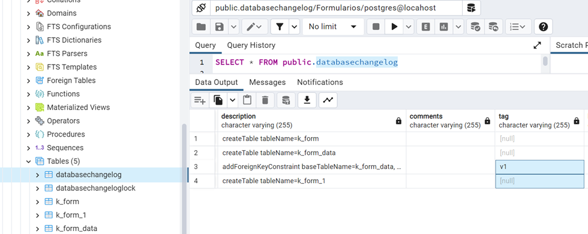

Puntos a resaltar:
* En el nodo de las tablas, se puede observar la nueva tabla creada, **K_FORM_1**.
* En los resultados del **Select* se puede observar que el registro 4 no contiene un valor en la columna *Tag*, lo que indica que este changesets no pertenece al conjunto de cambios de la versión 1.

**En este ejemplo sólo se ejecutó 1 changesets adicional, sin embargo, en caso de ejecutar varios changesets, todos los posteriores al Tag = V1, serán eliminados al momento de ejecutar el comando rollback-tag, como se muestra a continuación**.

Para realizar el *rollback-tag*, se ejecuta el siguiente comando:

```bash
liquibase rollback --tag=v1
```
Este comando lo que realizará será deshacer todos los cambios hasta encontrar el changesets que contiene el *Tag=v1*, tal como se visualiza:

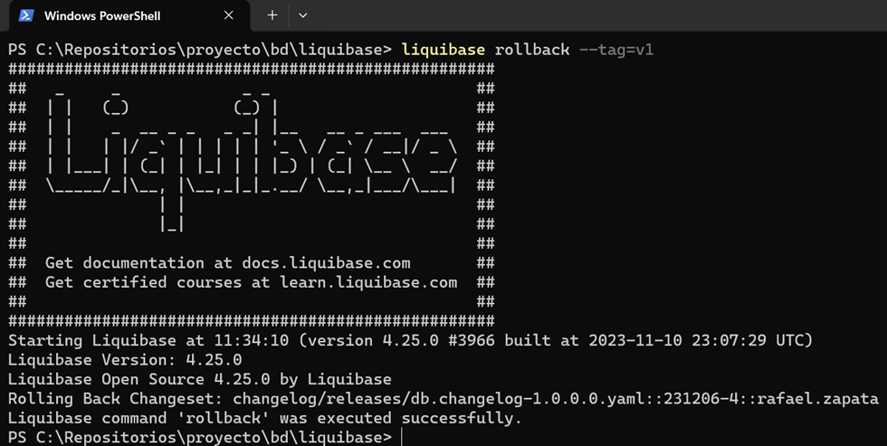

Puntos a resaltar:

* En la salida informa que el changesets con id *231206-4* fue el que se hizo rollback.

Inspeccionando nuevamente la tabla *Databasechangelog* y los objetos de tablas, se observa de la siguiente manera:

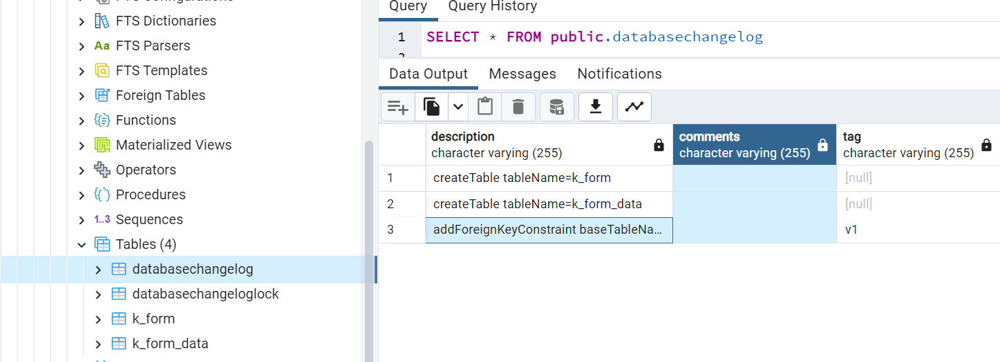

##### Más información

Para más información consultar la documentación oficial de Liquibase, disponible en: [Documentación Liquibase](https://docs.liquibase.com/home.html?).


[Regresar](../README.md)